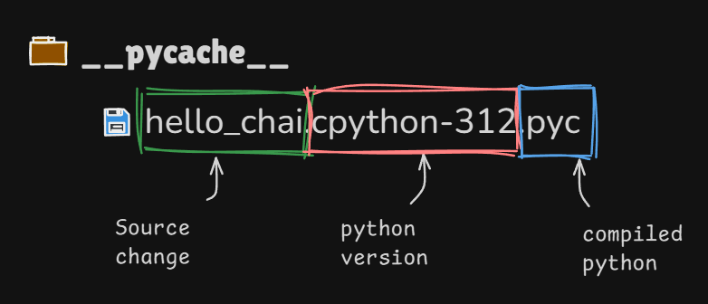

> In Python, we can import function from another file and execute it.

> When you import a function or any module, Python compiles the files into bytecode for faster execution. This compiled bytecode is stored in the `__pycache__` folder inside the directory where your Python files are located.

> You do not need to worry about `__pycache__` folder. It is automatically managed by Python.

## Python Inner Working

1. Python reads the code from top to bottom.
2. **It Compiles the code into bytecode**. The bytecode is stored in the **`__pycache__`** folder. This byte code is mostly hidden from you. In some cases, you can see it like importing a module or function.
3. The byte code is **low level** and **Platform Independent**.
4. **Python Virtual Machine** comes with Python and is responsible for executing the byte code.
5. Byte code runs faster than the source code.
6. **`.pyc`** is the extension for byte code files.

## Python Virtual Machine

-   It is the runtime environment where your python code gets executed.
-   The **PVM** executes this bytecode line by line.
-   The **PVM** is the part of Python's interpreter.
-   For a file executed directly, Python compiles the code into bytecode in memory, but it does not save the bytecode as a .pyc file. That is the reason, you do not see the **`__pycache__`** folder.
-   **Byte Code** is not **Machine Code**.
