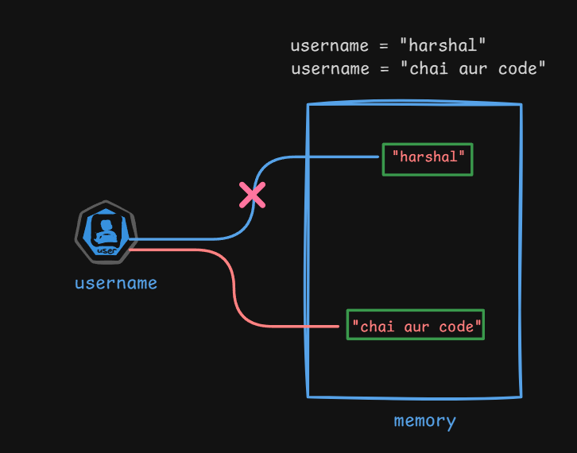

# Immutable and Mutable in Python

## Mutable :

Mutable objects whose value can be changed in the memory after they created.

## Immutable :

Immutable objects whose value cannot be changed in the memory after they created.

```python
username = "harshal"
username = "chai aur code"
```

<center></center>

> Note: You might thinking, **immmutable** means **read-only** or **unchangeable** but in above example, you can change the value of `username` variable.
>
> Actually string 'harshal' is "immutable" and not the variable `username`.
>
> We are not able to modify the string 'harshal' in the memory. We are just changing the reference of variable `username` to another string 'chai aur code'.
