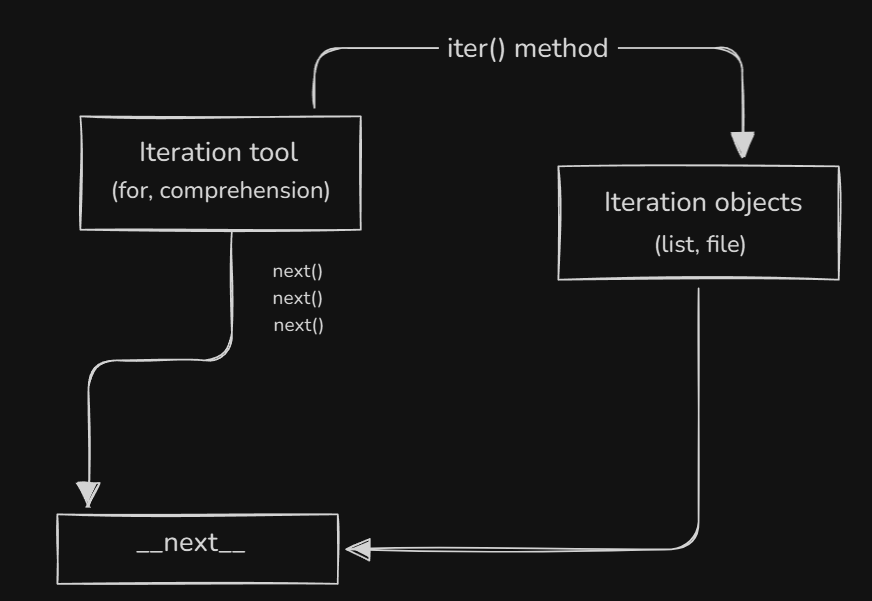

# Behind-the-Scenes Working of Loops and Iteration in Python

### Key Components:

1. **Iteration Objects**:

    - Objects like `lists`, `files`, or any object that supports iteration.
    - These objects can be passed to the `iter()` method to create an **iterator**.

2. **`iter()` Method**:

    - Converts an **iterable** (e.g., list or file) into an **iterator**.
    - An iterator keeps track of the current position during the iteration process.

3. **Iteration Tool**:

    - Tools like `for` loops or comprehensions use the `iter()` method to start iterating over objects.
    - Once the object becomes an iterator, the loop/tool uses the `next()` method.

4. **`__next__()` Method**:
    - The `next()` method (called internally) moves to the next item in the iterator.
    - When there are no more items, it raises a `StopIteration` exception to signal the end of the loop.

### Flow of Operation:

1. The **iteration tool** (e.g., `for` loop) calls `iter()` on an **iterable object** (like a list or file).
2. Python converts the object into an **iterator**.
3. The loop/tool calls `next()` internally to fetch each item.
4. Once all items are iterated, the loop stops automatically when the `StopIteration` exception is raised.

### Summary:

-   The **iterable-iterator relationship** is managed behind the scenes in Python.
-   Tools like `for` loops and comprehensions automate the process of calling `iter()` and `__next__()`.
-   This design makes Python's iteration process both powerful and user-friendly.
